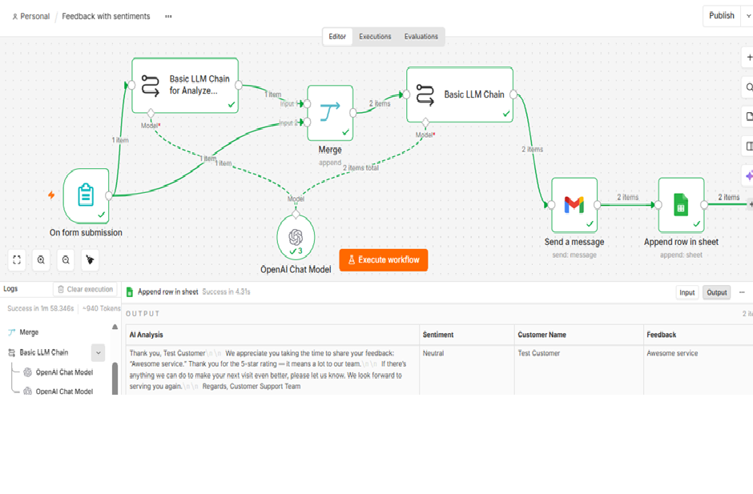

# 🤖 Customer Feedback Sentiment AI Agent

An AI-powered customer feedback automation workflow built using **n8n, AI, Gmail and Google Sheets**, with a strong focus on **Quality Engineering, data integrity and workflow reliability**.

## 🎯 Project Overview

This project automates the customer feedback process from submission to personalized response and data storage.

### Workflow

**Customer Feedback → AI Analysis → Sentiment & Points → Personalized Response → Email → Google Sheets**

The project demonstrates how **AI Automation + Quality Engineering** can be combined to build workflows that are not only functional, but also reliable and testable.

## 🔄 How the Workflow Works

1. Customer submits feedback through a form.
2. n8n receives the feedback.
3. AI analyzes the customer feedback.
4. Sentiment and points are determined.
5. AI generates a personalized response.
6. Two intended email responses are sent.
7. One consolidated customer record is stored in Google Sheets.

## 🛠️ Technologies Used

* **n8n** — Workflow Automation
* **AI / LLM** — Sentiment Analysis and Response Generation
* **Gmail** — Automated Email Communication
* **Google Sheets** — Customer Data Storage
* **Quality Engineering** — Workflow Validation and Reliability Testing

## 🧪 QA & Testing Approach

The workflow was tested for:

* Functional scenarios
* End-to-end workflow execution
* Branching logic
* Data mapping
* Email delivery
* Duplicate processing
* Edge cases
* Data integrity
* Regression scenarios

## 🐞 Defect Identified

During testing, I discovered that one customer feedback submission was generating **two records in Google Sheets**.

### Expected

**1 submission → 2 intended emails → 1 Google Sheets record**

### Actual

**1 submission → 2 intended emails → 2 Google Sheets records ❌**

The email functionality itself was working correctly.

The issue was related to multiple workflow items reaching the Google Sheets node.

## 🔧 Resolution

Instead of changing the working email logic, I separated the workflow paths and introduced a **Limit node before Google Sheets**.

This ensured that only the intended item reached the Google Sheets storage step.

## ✅ Final Result

**1 customer submission**

↓

**2 intended emails successfully sent**

↓

**1 consolidated Google Sheets record**

The duplicate-record scenario was also treated as a **regression test scenario** so that the same issue can be checked whenever relevant workflow logic or mappings are changed.

## 💡 Quality Engineering Learning

This project reinforced an important principle:

> **AI automation should be reliable by design, not simply fixed when something breaks.**

Building the workflow is only the beginning. Testing the data flow, branches, integrations, edge cases and regression scenarios is equally important.

## 📸 Workflow Overview

The workflow connects customer feedback submission, AI analysis, personalized response generation, email communication and Google Sheets storage.

## 🔐 Security

No production API keys, passwords, access tokens or confidential customer information should be included in this repository.

## 👩‍💻 Author

**Lipika Chaliha**

AI-Driven QA Test Lead | 11+ Years QA Experience | AI Testing | Quality Engineering | n8n Workflow Automation | ISTQB Certified
